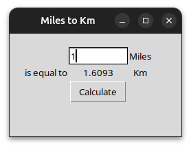

# Miles to Kilometers Converter

This is a basic Python program using the `tkinter` library to convert miles to kilometers. The app provides an interface where the user can input a value in miles, and it displays the corresponding value in kilometers.

## Features
- Input the number of miles.
- Press the "Calculate" button to convert the miles into kilometers.
- Simple and clean interface using `tkinter`.

## Requirements
- Python 3.x
- `tkinter` library (comes pre-installed with Python)

## How to Use
1. Clone or download the project from GitHub.
2. Run the `python` script to open the GUI.
3. Enter a value in miles and press "Calculate" to see the conversion in kilometers.

### Purpose
This project was created as a learning exercise to practice using `tkinter` for basic GUI applications.

---

Feel free to improve or expand on the project!
