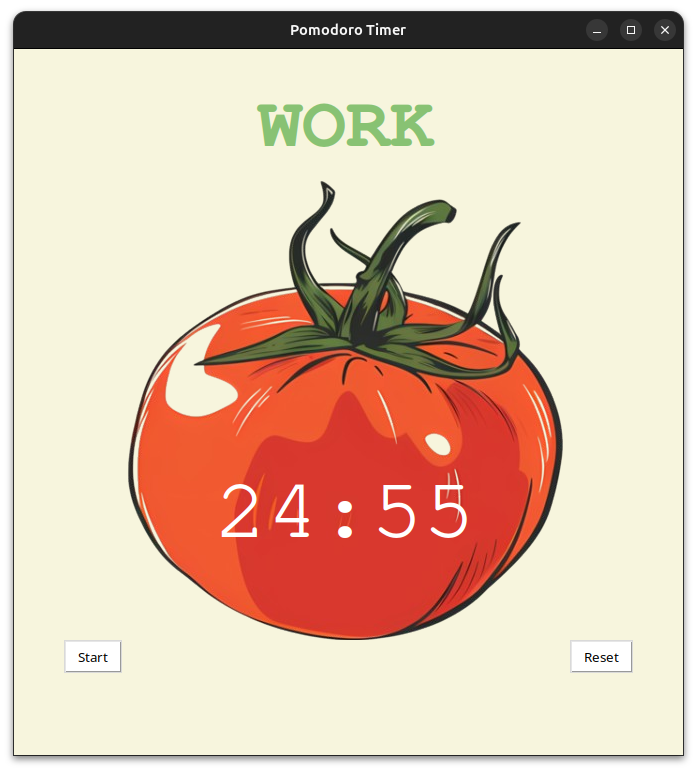

# Pomodoro Timer



## Description

The Pomodoro Timer is a simple and effective tool for managing your time and boosting productivity using the Pomodoro Technique. It features a countdown timer for work sessions and breaks, helping you stay focused and organized.

## Features

- Customizable work, short break, and long break intervals.
- Visual indication of timer status.
- Notification pop-ups for breaks.
- Simple and user-friendly interface built with Tkinter.

## Requirements

- Python 3.x
- Tkinter (usually included with Python installations)
- On Linux, ensure you have the necessary libraries for GUI applications.

## Installation

1. Clone this repository to your local machine:

   ```bash
   git clone https://github.com/your_username/Pomodoro_App.git
   ```
2. If you are a Linux user, simply add execute permissions to the main executable:

   ```bash
   chmod +x main
   ./main

   ```

