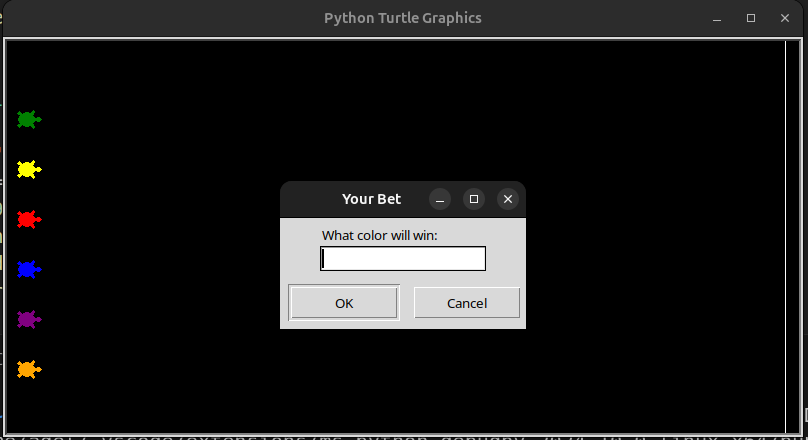

# Turtle Race Game

A fun and exciting game where you bet on which turtle will win the race! Six colorful turtles race to the finish line, moving randomly along the way. Your job is to guess the winner, and if your chosen turtle wins, so do you!

## How to Play:
1. Run the `main.py` file.
2. Place your bet by selecting a turtle color.
3. Watch the race and see if you guessed right!

### Start of the Game

### End of the Game (Winner Announcement)

