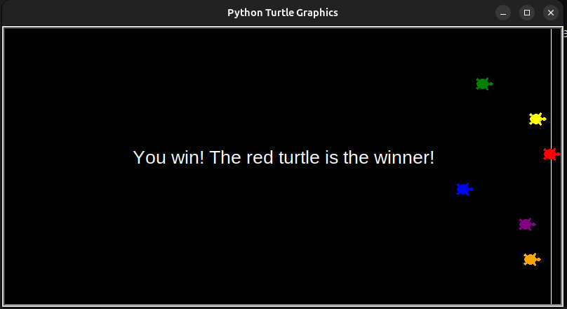

# Turtle Race Game

A fun game where you bet on which turtle will win the race! Six colorful turtles race to the finish line, and your job is to guess the winner. If your turtle wins, you win the game!

## How to Play:
1. Run the `main.py` file.
2. Place your bet by selecting a turtle color.
3. Watch the race and see if you guessed right!

### Start of the Game

### End of the Game (Winner Announcement)

