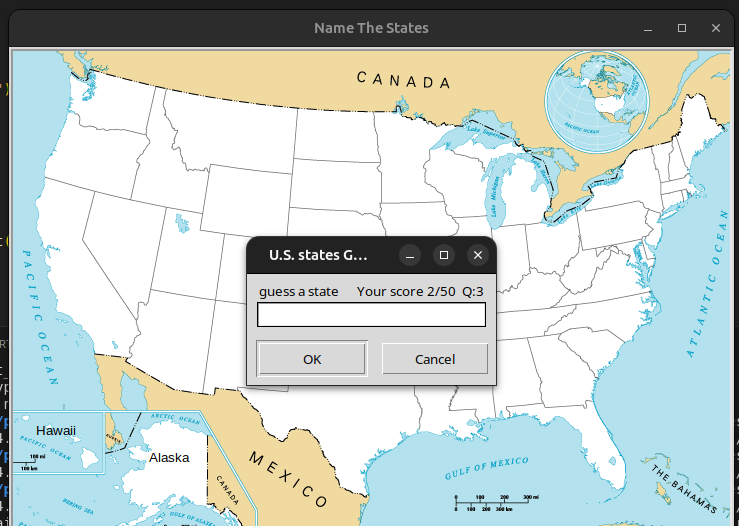

# U.S. State Guessing Game

This project is a Python game where players guess the names of all 50 U.S. states. Each correct guess displays the state's name on the map.

### Game Start:

### Duplicate State Guess:

