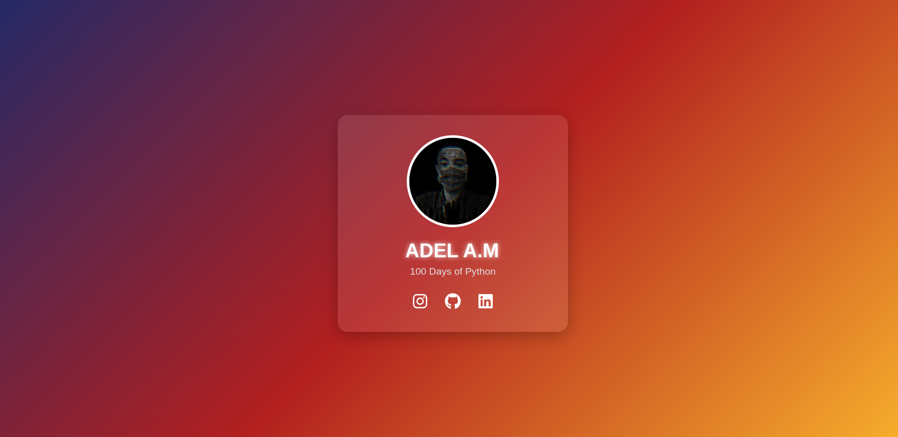

# My Personal Site

This is a simple personal website built with Flask.

## Project Structure

- `server.py`: The main Flask application file.
- `static/`: Contains static files like CSS and images.
- `templates/`: Contains HTML templates.

## Screenshot

