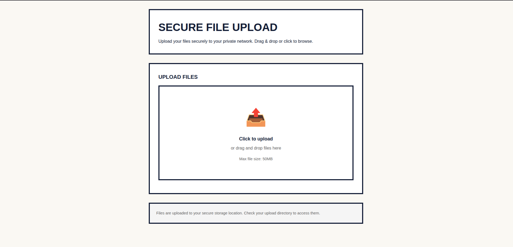

# Secure File Upload Server

A simple and secure file upload server built with Flask.

## How to Run

```shell
# Install dependencies
pip install flask

# Run the server
python app.py
```
## Screenshot



