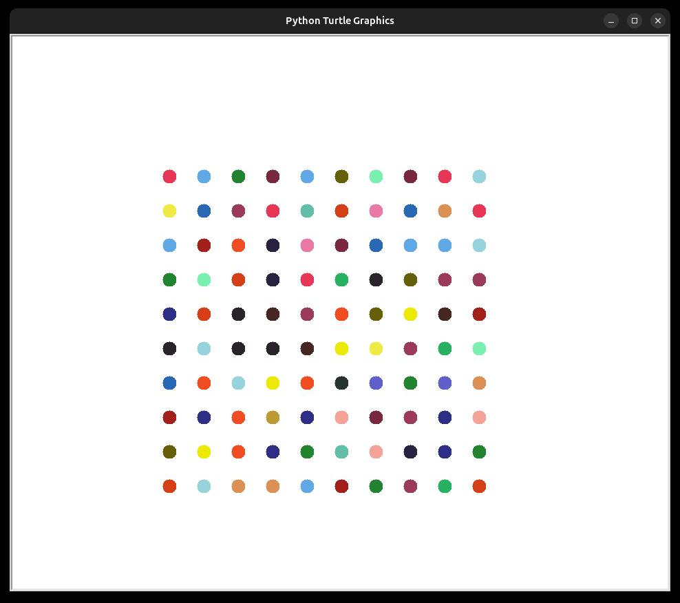

## Result

Below is the resulting image generated by running the `main.py` script:

## How It Works

- The script uses the `turtle` library to create a 10x10 grid of colorful dots.
- A pre-defined list of colors is randomly chosen for each dot.
- You can modify the list of colors or the grid size to create different patterns and styles.
