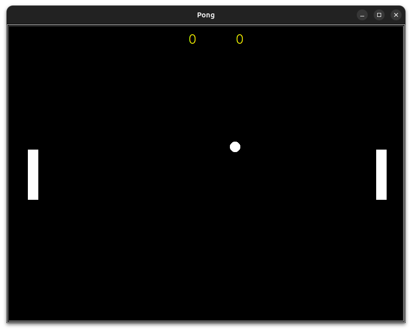
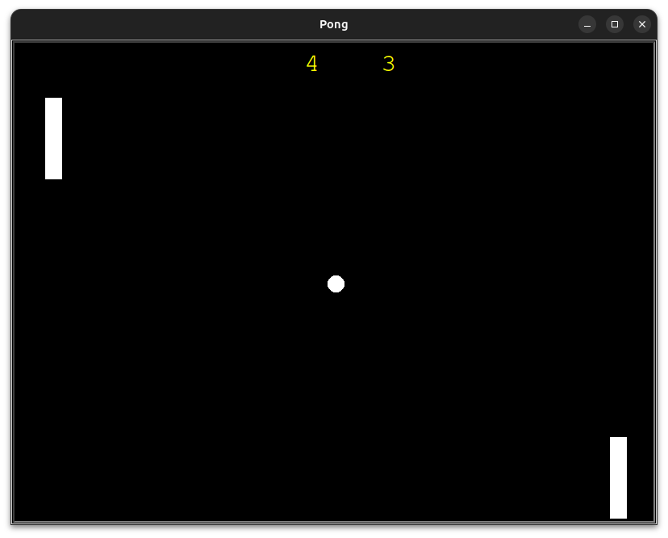

# Pong Game

## Description

This is a classic Pong game implementation using Python's Turtle graphics library. The game features two paddles controlled by players and a ball that bounces between them. The objective is to prevent the ball from passing your paddle while trying to make it pass your opponent's paddle.

## Features

- Two-player gameplay
- Scoreboard to keep track of points
- Increasing ball speed as the game progresses
- Simple and intuitive controls

## Screenshots

*Game start screen*

*Gameplay with score*

## How to Play

1. Run the `main.py` file to start the game.
2. Player 1 (left paddle) controls:
   - 'W' key to move up
   - 'S' key to move down
3. Player 2 (right paddle) controls:
   - Up arrow key to move up
   - Down arrow key to move down
4. The ball will automatically start moving after a short delay.
5. Prevent the ball from passing your paddle and try to make it pass your opponent's paddle.
6. Score points when the ball passes your opponent's paddle.
7. The game continues until you close the window.

## Requirements

- Python 3.x
- Turtle graphics library (usually comes pre-installed with Python)

## Installation

1. Clone this repository:
