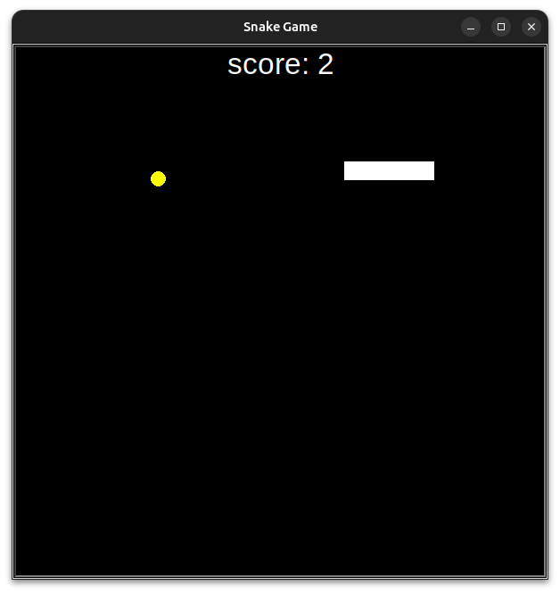
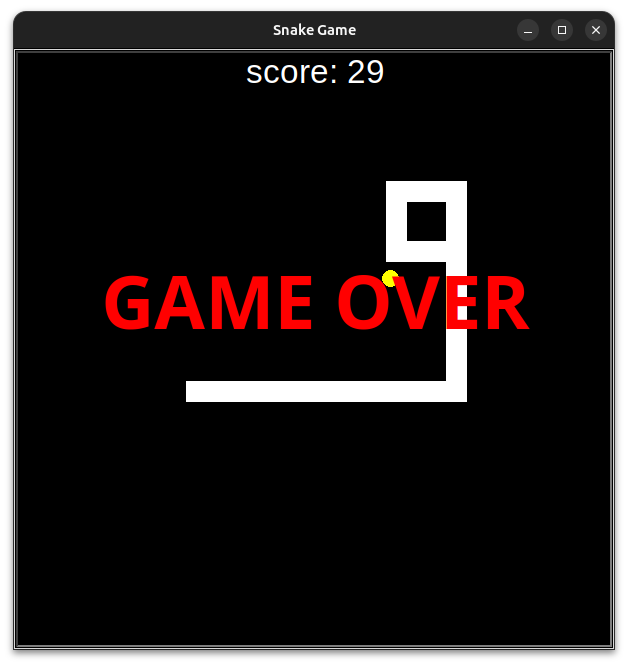

# Snake Game 🐍

This is a simple **Snake Game** built using Python's Turtle module. The player controls a snake that moves around the screen, eats food, and grows in size. The goal is to score as many points as possible before colliding with the walls or the snake's own tail.

## Game Features
- **Control the Snake**: Use the arrow keys (`Up`, `Down`, `Left`, `Right`) to guide the snake.
- **Eat Food**: The snake will grow in length and earn points whenever it eats food.
- **Game Over**: The game ends when the snake hits the boundary or its own tail.
- **Score Tracking**: The score is displayed at the top of the screen, and a "Game Over" message appears when the game ends.

## Files in the Project
1. **`main.py`**: The main game loop that initializes the screen, handles user input, and controls game logic.
2. **`snake.py`**: Contains the `Snake` class that controls the movement and growth of the snake.
3. **`food.py`**: Contains the `Food` class that spawns food for the snake to eat.
4. **`scoreboard.py`**: Manages the score display and handles the game over state.

## Images
 

 

## How to Run the Game
1. Ensure you have Python installed on your computer.
2. Clone this repository or download the files.
3. Open your terminal or command prompt.
4. Navigate to the directory containing the game files.
5. Run the game using the following command:
   ```bash
   python main.py
